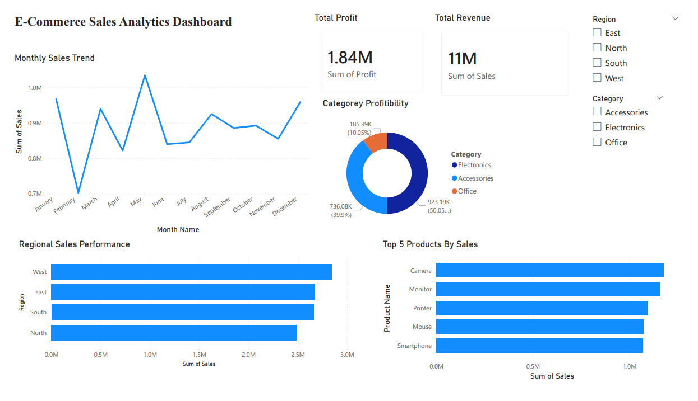

# E-Commerce Sales Analytics Dashboard
## Dashboard Preview



## Project Overview

This project analyzes e-commerce sales data using Python, PostgreSQL, SQL, and Power BI to generate meaningful business insights and build an interactive analytics dashboard.

The workflow includes:
- Data cleaning and preprocessing using Pandas
- SQL-based business analysis in PostgreSQL
- Interactive dashboard development in Power BI
- KPI reporting and business insight generation

This project demonstrates a complete end-to-end Data Analytics workflow.


---

# Tools & Technologies Used

- Python
- Pandas
- PostgreSQL
- SQL
- Power BI
- GitHub

---

# Dataset Information

The dataset contains e-commerce transactional sales data including:

- Order Date
- Product Name
- Category
- Region
- Quantity
- Sales
- Profit

Additional engineered columns:
- Year
- Month
- Month Name

---

# Project Workflow

## 1. Data Cleaning using Python

Performed:
- Missing value checks
- Duplicate removal
- Datatype conversion
- Date formatting
- Feature engineering

Python libraries used:
- pandas

---

## 2. SQL Analysis using PostgreSQL

Business analysis performed using SQL queries such as:

- Total Revenue & Profit Analysis
- Top Selling Products
- Category Profitability
- Monthly Sales Trend Analysis
- Regional Sales Performance
- Top Profitable Products

SQL concepts used:
- GROUP BY
- ORDER BY
- Aggregate Functions
- LIMIT
- Data Formatting

---

## 3. Power BI Dashboard Development

Created an interactive dashboard including:

### KPI Cards
- Total Revenue
- Total Profit

### Visualizations
- Monthly Sales Trend
- Regional Sales Performance
- Category Profitability
- Top 5 Products by Sales

### Interactive Features
- Region Filters
- Category Filters

---

# Dashboard Preview


---

# Key Business Insights

- West region generated the highest sales and profit.
- Electronics category contributed the highest profit.
- Camera was the highest-selling and most profitable product.
- February showed the weakest sales performance.
- January and December demonstrated strong seasonal sales trends.

---

# Key Skills Demonstrated

- Data Cleaning using Pandas
- SQL Aggregation & Analysis
- PostgreSQL Database Management
- Power BI Dashboard Development
- KPI Reporting
- Business Insight Generation
- Interactive Dashboard Filtering
- Data Visualization
- Analytical Thinking

---

# Project Folder Structure

```text
PROJECT_1_ECOMMERCE_ANALYTICS/

│
├── dataset/
│     └── cleaned_ecommerce_sales.csv
│
├── python/
│     └── data_cleaning.py
│
├── sql/
│     └── sql_queries.sql
│
├── powerbi/
│     └── project_1_ecommerce_dashboard.pbix
│
├── screenshots/
│     └── dashboard.png
│
└── README.md
